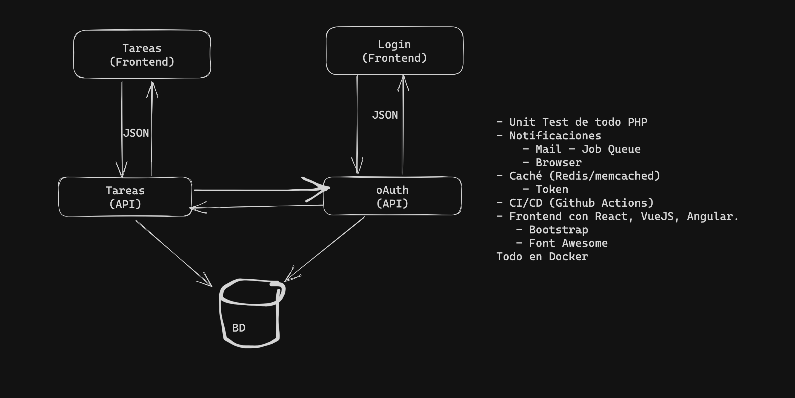

# Proyecto Gestor de Tareas

ISBO - TA2 - Programación II

El presente proyecto fue realizado utilizando las siguientes herramientas:
- Docker / Compose
- Laravel 10
- PHP 8.2
- MySQL 8.1
- Redis

El código del resto de los contenedores se encuentra en:
- https://github.com/mflo80/gtareas-oauth
- https://github.com/mflo80/gtareas-api
- https://github.com/mflo80/gtareas-frontend

Para estos cuatro proyectos, se utilizó la imagen de Docker creada por ggmartinez;
solo que se procedió a modificar la misma, siendo agregada a esta la extensión de php
para Redis (ver archivo Dockerfile).

Es de mencionar que se cargan adjunto al presente, un script de instalación,
el archivo de configuración docker-compose.yml para que se puedan ejecutar 
los contenedores en docker de las herramientas antes mencionadas y la imagen
aportada por el teacher de programación, la cual contiene el diagrama del proyecto
y lo a realizar en el mismo.



### INSTALACIÓN:
Descargar este proyecto en una carpeta local de su computadora y ejecutar el 
archivo gtareas-run.sh. Este comenzará la instalación, creando las carpetas 
del resto de los proyectos, descargando los mismos desde cada repositorio.
También actualizará composer en cada una de ellas y ejecutará los contenedores de
Docker de cada proyecto (Se debe de tener instalado docker).

### Dockerfile
```
FROM ggmartinez/laravel:php-82-Apache

WORKDIR /app

RUN yum update -y
RUN yum install -y php-redis
```

Para crear una nueva imagen a partir de este Dockerfile, se debe de ejecutar el siguiente
comando en la misma carpeta donde se encuentra el archivo:

- docker build -t usuario/nombre_imagen:tag
  
Ejemplo: para este proyecto la imagen fue creada como marftoru/laravel:php82-redis


### docker-compose.yml
IMPORTANTE: se debe de modificar la dirección de la variable SERVER_RESTABLECER_PASSWORD del contenedor gtoauth, a fin de que al solicitar un usuario restablecer su contraseña, lo redirija a la página correspondiente, o sea dicha dirección sería la de la página principal al cual se ingresa desde el navegador al frontend Ej: http://localhost:8000 o http://gestordetareas.com:8000, etc.

Lo mencionado se debe de realizar antes de comenzar la instalación de la aplicación.

```
version: '3'

services:
  gtdb:
    image: marftoru/mysql:8.1.0-max
    container_name : gtdb
    command:
      --default-authentication-plugin=mysql_native_password
      --character-set-server=utf8mb4
      --collation-server=utf8mb4_unicode_ci
    ports:
      - '3306:3306'
    restart: unless-stopped
    volumes:
      - './gtareas-db:/var/lib/mysql'
    environment:
      - MYSQL_ROOT_PASSWORD=gtareas
      - MYSQL_DATABASE=gtareas
      - TZ=America/Montevideo
      - LANG=C.UTF-8
    healthcheck:
      test: "exit 0"
    networks:
      gtnet:
        ipv4_address: 192.168.66.2

  gtredis:
    image: redis:bookworm
    container_name : gtredis
    restart: unless-stopped
    depends_on:
      gtdb:
        condition: service_healthy
    networks:
      gtnet:
        ipv4_address: 192.168.66.3

  gtmail:
    image: rnwood/smtp4dev:v3
    container_name : gtmail
    ports:
      - '5000:80'
    restart: unless-stopped
    environment:
      - ServerOptions__HostName=gtmail
    depends_on:
      gtdb:
        condition: service_healthy
    networks:
      gtnet:
        ipv4_address: 192.168.66.4

  gtoauth:
    image: marftoru/laravel:php82-redis
    container_name : gtoauth
    ports:
      - '8002:8000'      
    restart: unless-stopped
    environment:
      - APP_NAME=gtareas
      - CACHE_DRIVER=redis
      - DB_CONNECTION=mysql
      - DB_HOST=gtdb
      - DB_PORT=3306
      - DB_DATABASE=gtareas
      - DB_USERNAME=root
      - DB_PASSWORD=gtareas
      - QUEUE_CONNECTION=database
      - MAIL_MAILER=smtp
      - MAIL_HOST=gtmail
      - MAIL_PORT=25
      - MAIL_USERNAME=null
      - MAIL_PASSWORD=null
      - MAIL_ENCRYPTION=ssl
      - MAIL_FROM_ADDRESS="no-reply@gtareas.com"
      - REDIS_HOST=gtredis
      # Se debe cambiar los párametros de esta variable por la IP y Puerto del servidor al cual ingresarán los Clientes a la Web de Gestor de Tareas.
      - SERVER-RESTABLECER_PASSWORD=http://localhost:8000
      - SESSION_LIFETIME=60
    volumes:
      - './gtareas-oauth:/app'
    depends_on:
      gtdb:
        condition: service_healthy
      gtredis:
        condition: service_started
      gtmail:
        condition: service_started
    networks:
      gtnet:
        ipv4_address: 192.168.66.5

  gtapi:
    image: marftoru/laravel:php82-redis
    container_name : gtapi
    ports:
      - '8001:8000' 
    restart: unless-stopped
    environment:
      - APP_NAME=gtareas
      - CACHE_DRIVER=redis
      - DB_HOST=gtdb
      - DB_PORT=3306
      - DB_USERNAME=root
      - DB_PASSWORD=gtareas
      - DB_DATABASE=gtareas
      - REDIS_HOST=gtredis
      - GTOAUTH_AUTENTICADO=gtoauth:8000/api/auth/autenticado
      - MAIL_MAILER=smtp
      - MAIL_HOST=gtmail
      - MAIL_PORT=25
      - MAIL_USERNAME=null
      - MAIL_PASSWORD=null
      - MAIL_ENCRYPTION=ssl
      - MAIL_FROM_ADDRESS="no-reply@gtareas.com"
      - SESSION_LIFETIME=60
      - SESSION_LASTACCESS=20
      - CATEGORIAS=Análisis,Diseño,Implementación,Verificación,Mantenimiento
      - ESTADOS=Activa,En espera,Atrasada,Cancelada,Finalizada
    volumes:
      - './gtareas-api:/app'
    depends_on:
      gtdb:
        condition: service_healthy
      gtredis:
        condition: service_started
      gtoauth:
        condition: service_started
      gtmail:
        condition: service_started
    networks:
      gtnet:
        ipv4_address: 192.168.66.6

  gtfrontend:
    image: marftoru/laravel:php82-redis
    container_name : gtfrontend
    ports:
      - '8000:8000'
    restart: unless-stopped
    environment:
      - APP_NAME=gtareas
      - GTOAUTH_LOGIN=gtoauth:8000/api/auth/login
      - GTOAUTH_LOGOUT=gtoauth:8000/api/auth/logout
      - GTOAUTH_AUTENTICADO=gtoauth:8000/api/auth/autenticado
      - GTOAUTH_USUARIOS=gtoauth:8000/api/usuarios
      - GTOAUTH_PASSWORD=gtoauth:8000/api/password
      - GTAPI_TAREAS=gtapi:8000/api/tareas
      - GTAPI_ASIGNA=gtapi:8000/api/asigna
      - GTAPI_HISTORIAL_TAREAS=gtapi:8000/api/historial/tareas
      - GTAPI_HISTORIAL_COMENTARIOS=gtapi:8000/api/historial/comentarios
      - GTAPI_CORREOS=gtapi:8000/api/correos
      - GTAPI_COMENTARIOS=gtapi:8000/api/comenta
      - SESSION_DRIVER=cookie
      - SESSION_LIFETIME=60
      - SESSION_LASTACCESS=20
      - CATEGORIAS=Análisis,Diseño,Implementación,Verificación,Mantenimiento
      - ESTADOS=Activa,En espera,Atrasada,Cancelada,Finalizada
    volumes:
      - './gtareas-frontend:/app'
    depends_on:
      gtapi:
        condition: service_started
    networks:
      gtnet:
        ipv4_address: 192.168.66.7

networks:
  gtnet:
    external: true
```


### Script de Instalación

Se debe ejecutar el siguiente script, para poder descargar el resto de los repositorios y
para comenzar así la instalación y configuración de la aplicación:

**sh gtareas-install.sh**

(Observaciones: este fue probado únicamente en Ubuntu Server 22.04 y Centos 7)

```
#!/bin/bash
FILE=docker-compose.yml

gtoauth_uno() {
	echo "------------------------------------------------------"
	echo "          GENERANDO KEY PARA GTOAUTH                  "
	echo "------------------------------------------------------"
	docker exec -ti gtoauth php artisan key:generate &&
	echo "------------------------------------------------------"
	echo "            CARGANDO BASE DE DATOS                    "
	echo "------------------------------------------------------"
	docker exec -ti gtoauth php artisan migrate:fresh --seed
}

gtoauth_dos() {
	echo "------------------------------------------------------"
	echo "           GENERANDO PASSPORT KEYS                    "
	echo "------------------------------------------------------"
	docker exec -ti gtoauth php artisan passport:keys
	docker exec -ti gtoauth php artisan passport:client --password --no-interaction --name="gtareas"
	docker exec -ti gtoauth php artisan passport:client --personal --no-interaction --name="gtareas"
	echo "------------------------------------------------------"
	echo "         EJECUTANDO TAREAS PROGRAMADAS                "
	echo "------------------------------------------------------"
	docker exec -d gtoauth php artisan schedule:run >> /dev/null 2>&1
	echo "------------------------------------------------------"
	echo "------------------------------------------------------"
	echo "------------------------------------------------------"
	echo "       FINALIZADA CONFIGURACIÓN DE GTOAUTH            "
	echo "------------------------------------------------------"
	echo "------------------------------------------------------"
	echo "------------------------------------------------------"
}

gtapi_uno() {
	echo "------------------------------------------------------"
	echo "           GENERANDO KEY PARA GTAPI                   "
	echo "------------------------------------------------------"
	docker exec -ti gtapi php artisan key:generate &&
	echo "------------------------------------------------------"
	echo "            CARGANDO BASE DE DATOS                    "
	echo "------------------------------------------------------"
	docker exec -ti gtapi php artisan migrate --seed
	echo "------------------------------------------------------"
	echo "------------------------------------------------------"
	echo "------------------------------------------------------"
	echo "        FINALIZADA CONFIGURACIÓN DE GTAPI             "
	echo "------------------------------------------------------"
	echo "------------------------------------------------------"
	echo "------------------------------------------------------"
}

gtfrontend_uno() {
	echo "------------------------------------------------------"
	echo "          GENERANDO KEY PARA GTFRONTEND               "
	echo "------------------------------------------------------"
	docker exec -ti gtfrontend php artisan key:generate
	echo "------------------------------------------------------"
	echo "------------------------------------------------------"
	echo "------------------------------------------------------"
	echo "      FINALIZADA CONFIGURACIÓN DE GTFRONTEND          "
	echo "------------------------------------------------------"
	echo "------------------------------------------------------"
	echo "------------------------------------------------------"
}

gttest() {
	echo "------------------------------------------------------"
	echo " ///////        GENERANDO UNIT TEST           /////// "
	echo "------------------------------------------------------"
	docker exec -ti gtoauth php artisan test
	docker exec -ti gtapi php artisan test
}

echo "------------------------------------------------------"
echo "            INICIANDO GESTOR DE TAREAS                "
echo "------------------------------------------------------"

echo "------------------------------------------------------"
echo "         VERIFICANDO SI YA EXISTE RED GTNET           "
echo "------------------------------------------------------"

if ping -c 1 -t 100 192.168.66.1; then
	echo La RED gtnet ya se encuentra creada
else
	echo "------------------------------------------------------"
	echo "                CREANDO RED GTNET                     "
	echo "------------------------------------------------------"
	docker network create --driver=bridge --subnet=192.168.66.0/24 --gateway=192.168.66.1 gtnet
fi

echo "------------------------------------------------------"
echo "               CREANDO DIRECTORIOS                    "
echo "------------------------------------------------------"

if [ ! -d gtareas-db ]; then
	mkdir gtareas-db
fi

if [ ! -d gtareas-oauth ]; then
	echo "------------------------------------------------------"
	echo "             INSTALANDO GTAREAS-OAUTH                 "
	echo "------------------------------------------------------"
	git clone https://github.com/mflo80/gtareas-oauth.git
	echo Cambiando a directorio gtareas-oauth
	cd gtareas-oauth
	echo Actualizando composer
	composer update
	echo Cambiando a directorio raíz
	cd ..
fi

if [ ! -d gtareas-api ]; then
	echo "------------------------------------------------------"
	echo "             INSTALANDO GTAREAS-API                   "
	echo "------------------------------------------------------"
	git clone https://github.com/mflo80/gtareas-api.git
	echo Cambiando a directorio gtareas-api
	cd gtareas-api
	echo Actualizando composer
	composer update
	echo Cambiando a directorio raíz
	cd ..
fi

if [ ! -d gtareas-frontend ]; then
	echo "------------------------------------------------------"
	echo "             INSTALANDO GTAREAS-FRONTEND              "
	echo "------------------------------------------------------"
	git clone https://github.com/mflo80/gtareas-frontend.git
	echo Cambiando a directorio gtareas-frontend
	cd gtareas-frontend
	echo Actualizando composer
	composer update
	echo Cambiando a directorio raíz
	cd ..
fi

if [ -f "$FILE" ]; then
	echo "------------------------------------------------------"
	echo "               INICIANDO CONTENEDORES                 "
	echo "------------------------------------------------------"
    	docker compose up -d
	wait
	if ping -c 1 -t 100 192.168.66.5; then
		echo "------------------------------------------------------"
		echo "            CONFIGURANDO GTAREAS-OAUTH                "
		echo "------------------------------------------------------"
		echo Cambiando a directorio gtareas-oauth
		cd gtareas-oauth
		echo Creando .env
		cp -f ".env.example" .env
		echo Ejecutando función uno
		gtoauth_uno
		echo Cambiando a directorio raíz
		cd ..
		echo Ejecutando función dos
		gtoauth_dos
	else
		echo ¡¡¡GTAREAS-OAUTH NO SE ENCUENTRA ACTIVA!!!
	fi

	if ping -c 1 -t 100 192.168.66.6; then
		echo "------------------------------------------------------"
		echo "            CONFIGURANDO GTAREAS-API                  "
		echo "------------------------------------------------------"
		echo Cambiando a directorio gtareas-api
		cd gtareas-api
		echo Creando .env
		cp -f ".env.example" .env
		echo Ejecutando funciones
		gtapi_uno
		echo Cambiando a directorio raíz
		cd ..
	else
		echo ¡¡¡GTAREAS-API NO SE ENCUENTRA ACTIVA!!!
	fi

	if ping -c 1 -t 100 192.168.66.7; then
		echo "------------------------------------------------------"
		echo "            CONFIGURANDO GTAREAS-FRONTEND             "
		echo "------------------------------------------------------"
		echo Cambiando a directorio gtareas-frontend
		cd gtareas-frontend
		echo Creando .env
		cp -f ".env.example" .env
		echo Ejecutando funciones
		gtfrontend_uno
		echo Cambiando a directorio raíz
		cd ..
	else
		echo ¡¡¡GTAREAS-FRONTEND NO SE ENCUENTRA ACTIVA!!!
	fi
fi
echo
gttest
echo "------------------------------------------------------"
echo "                   TEST FINALIZADO                    "
echo "------------------------------------------------------"
docker ps
echo "------------------------------------------------------"
echo " Para probar Gestor de Tareas, en tu PC ingresa a la  "
echo " dirección: $(hostname -I | cut -d' ' -f1):8000       "
echo "------------------------------------------------------"
echo "------------------------------------------------------"
echo "------------------------------------------------------"
echo "          GRACIAS POR USAR GESTOR DE TAREAS           "
echo "------------------------------------------------------"
echo "------------------------------------------------------"
```


### Script de restablecimiento de la Base de Datos "gtareas"

En caso de sólo tener que borrar de la base de datos "gtareas" para restablecer los datos
de la misma, deben ejecutar el siguiente script:

**sh gtareas-restart-db.sh**

(Observaciones: este fue probado únicamente en Ubuntu Server 22.04 y Centos 7)
